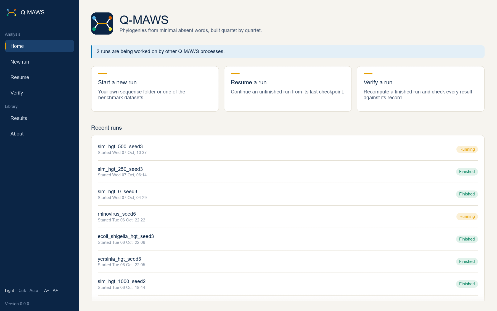
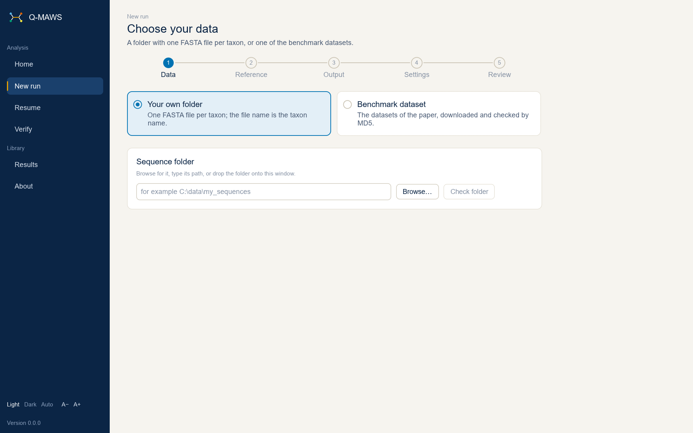
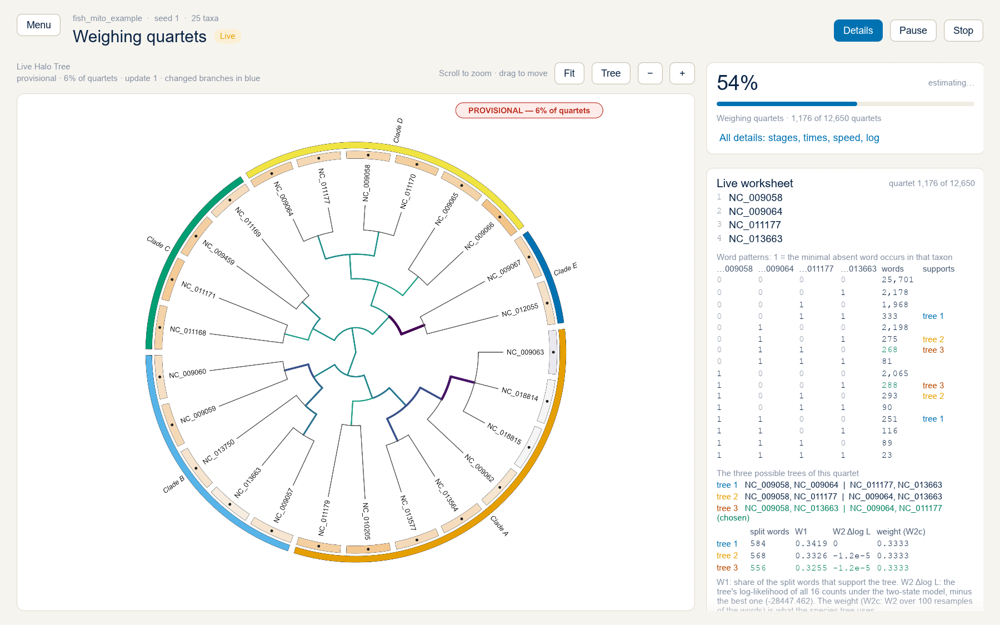
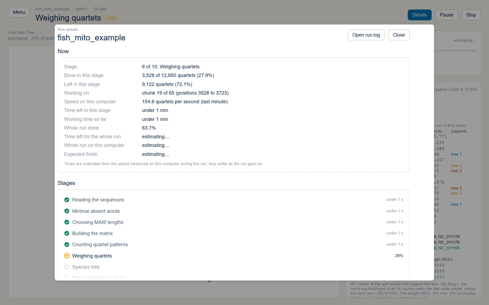
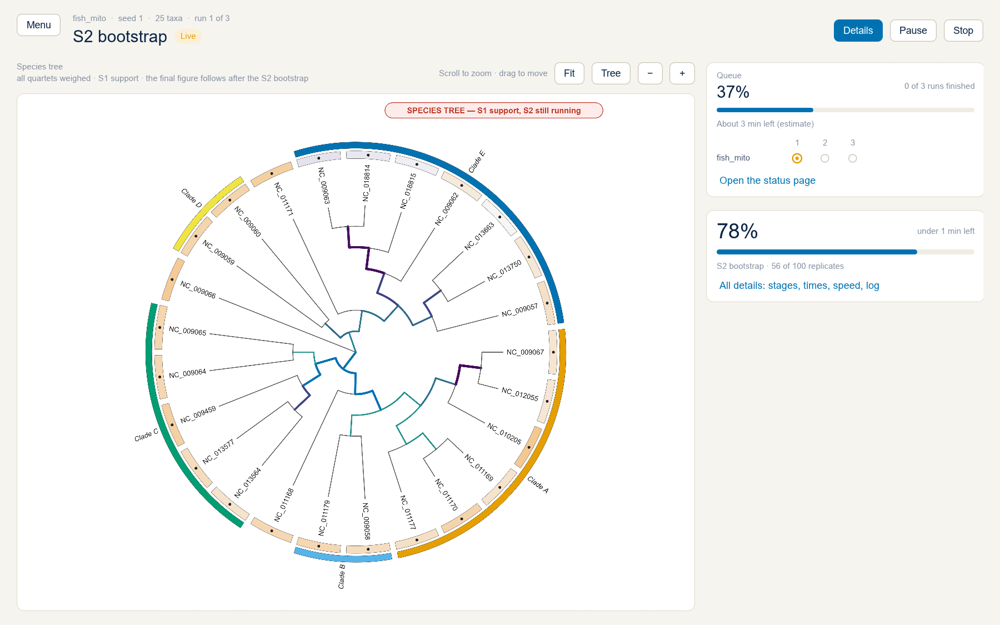
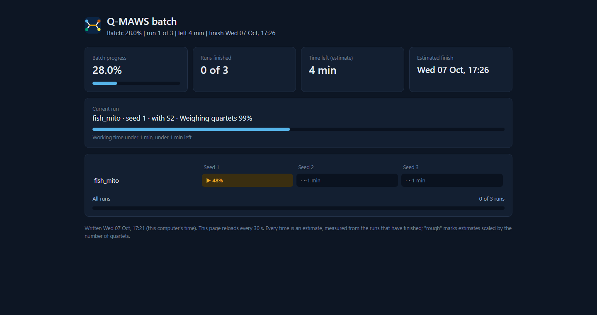
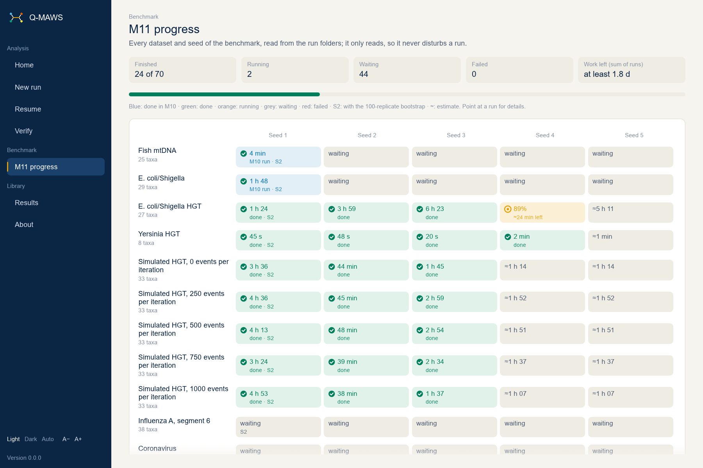
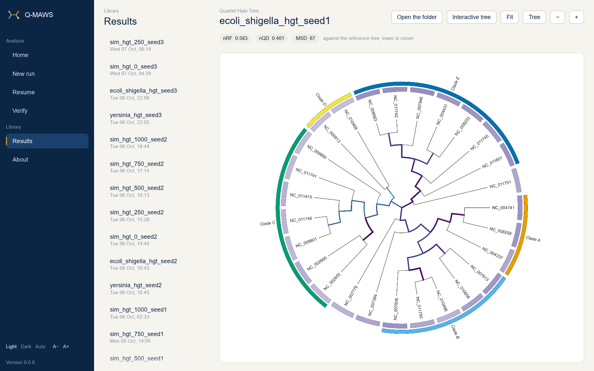
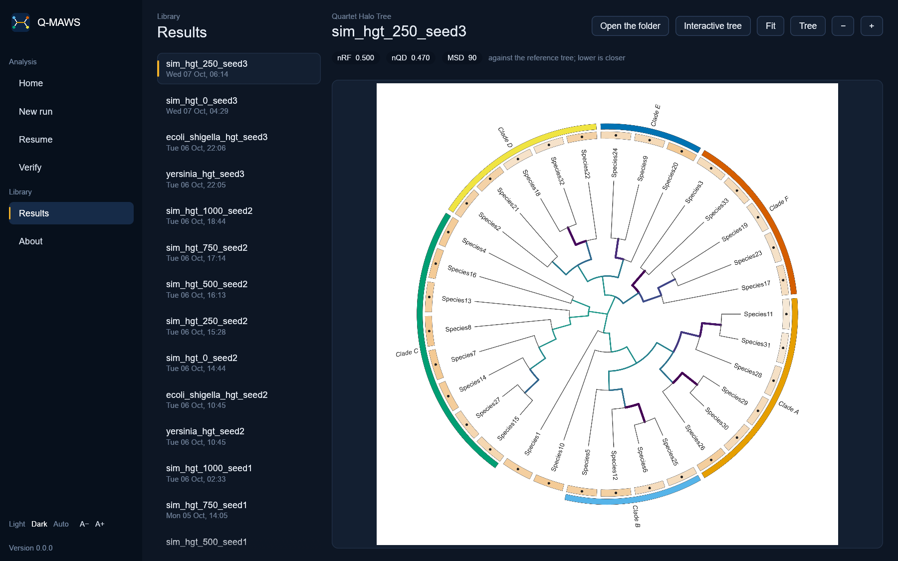

# User guide

How to use Q-MAWS: starting it, the commands, the terminal menu and the window, with screenshots of the program.

## Starting Q-MAWS

The ready-to-run bundles on the Releases page of the repository (and in `standalone/`) need no installation:

| System | Window | Terminal |
|---|---|---|
| Windows | Double-click `Q-MAWS.exe` | Double-click `run.bat` for the menu, or `run.bat <command>` |
| macOS | Double-click `Q-MAWS.app` | `./run.sh` for the menu, or `./run.sh <command>` |
| Linux | Double-click `Q-MAWS` (or `./Q-MAWS gui`) | `./run.sh` for the menu, or `./run.sh <command>` |

A double-clicked Q-MAWS writes its runs (`results/runs/`) and datasets (`data/`) into its own folder when it can write there, and otherwise into `Documents/Q-MAWS` in your home folder. The bundles are not signed: the first time, Windows may need "More info", then "Run anyway", and macOS a right-click on the app, then "Open". From the source code, `cargo build --release` makes `target/release/qmaws`, and `run.bat` / `run.sh` find it there.

## Commands available now

| Command | What it does |
|---|---|
| `qmaws menu` | The interactive main menu in the terminal (see "Interactive menu"); `run.bat` and `run.sh` without arguments start it |
| `qmaws gui` | Opens the graphical interface with the same menu (see "Graphical interface") |
| `qmaws --help`, `qmaws <command> --help` | Prints the available commands and options |
| `qmaws --version` | Prints the version |
| `qmaws run --dataset <id or all> | --input "<folder>" [--output "<run folder>"] [--reference "<tree.nwk>"] [--rename-duplicates] [--skip A,B] [--keep C,D] [--no-strand] [--lengths a,b,c] [--seed S] [--weighting w2-sym|w2-emp|none] [--replicates B] [--bootstrap B] [--cores N] [--memory-limit GB]` | Analyses the data as a resumable run: input check, MAW extraction, length selection, matrices, the pattern counts of every quartet, the quartet weights, the tree (wQFM-rs), S1 support and halo values, and S2 bootstrap support; then the comparison with the reference tree and the figures. A benchmark dataset that is missing is downloaded and checked first; `--dataset all` runs every dataset in turn, each in its own folder (continue an interrupted queue with `qmaws resume --all`). `--reference`: your own reference tree; its leaves must be exactly the taxa, and it is stored with the run (a benchmark dataset's AFproject tree is used by itself). Input warnings (as `qmaws inspect` lists them) are answered with `--rename-duplicates` (same name: append `_2`, `_3`, ...), `--skip` (leave out an empty file, the second of two identical sequences, or a short sequence) and `--keep` (keep the second of two identical sequences, or a short sequence); without answers the run stops and lists the warnings. `--cores` and `--memory-limit` limit the computer's resources for this session (results do not change). `--weighting`: the two-state symmetric model (default), the model with the frequencies of 0 and 1 of the full matrix, or no weighting. `--replicates`: resamples per quartet for W2c (default 100; 0 skips W2c). `--bootstrap`: S2 column-bootstrap replicates with W2b weights inside (default 100; 0 skips S2). `--seed` sets the quartet order and the resamples. `--no-live-tree` turns off the live provisional tree. `--gui` shows the run in the window, `--terminal` (the default) in the terminal. Stop with Ctrl+C and continue with `qmaws resume` |
| `qmaws verify --output "<run folder>" [--quick \| --full \| --quartet A,B,C,D \| --inputs] [--seed N] [--input "<folder>"]` | Checks a finished run against its `audit/` record: the input check, then the quick check (20 chunks of each chunked stage and 3 bootstrap replicates, drawn with a printed seed), the full recomputation of the root, or one quartet with its worksheet; the quick and full checks also recompute nRF, nQD and MSD from the stored tree and reference tree. Writes `report/verify_<time>.txt`; exit status 1 if anything differs. `--input` gives the data's new place if they were moved |
| `qmaws figures --output "<run folder>" [--reference "<tree.nwk>"] [--groups "<groups.tsv>"] [--otl] [--s2]` | Draws the figures of a finished run again (they are drawn after every run). `--reference` gives a tree for the tanglegram (a benchmark dataset's reference tree is found by itself); `--groups` a group file for the group bands; `--otl` takes the groups from the Open Tree of Life taxonomy (needs the internet); `--s2` colours the branches by S2 instead of S1 |
| `qmaws teach --example` or `qmaws teach --input "<folder>" [--reference "<tree.nwk>"]` | Prints the hand-calculable teaching worksheet (see `docs/TEACHING.md`) |
| `qmaws simulate-h3 [--output "<folder>"] [--seed S] [--replicates R] [--w2c-replicates B]` | Runs the long-branch simulation of hypothesis H3 (default: into `results/h3`, seed 1, 200 replicates per setting, 100 W2c resamples) and writes `recovery.csv`, `replicates.csv`, `recovery.svg` and `evaluation.txt`; about one minute |
| `qmaws toy-run [--output "<folder>"] [--blocks N] [--seed S] [--chunk-seconds T]` | Runs a toy computation that exercises checkpoints, resume and the progress display (development command) |
| `qmaws resume [--output "<run folder>" \| --all] [--gui \| --terminal]` | Resumes an unfinished run, in the terminal (default) or the window. Without `--output`, resumes the only unfinished run in `results/runs` and the other results folders you have used; if there are several, lists them. `--all` resumes every unfinished run one after another; the queue is saved, so after a stop the next `qmaws resume --all` continues it |
| `qmaws datasets [--data-dir "<folder>"]` | Lists the benchmark datasets with taxa, size, reference tree and status (ready, not downloaded, checksum mismatch, not extracted) |
| `qmaws download --dataset <id or all> [--data-dir "<folder>"]` | Downloads, verifies and extracts datasets, then checks the taxon count and the reference tree names. An interrupted download continues where it stopped the next time |
| `qmaws inspect --input "<folder or file>" [--records per-file\|per-record] [--reference "<tree.nwk>"]` | Reads your own sequences and shows the taxa, their lengths and removed characters, and every problem found with its choices; compares names with a reference tree if given |
| `qmaws matrix --dataset <id> | --input "<folder>" --output "<folder>" [--no-strand] [--lengths 7,8,9]` | Extracts the minimal absent words, selects the MAW lengths by entropy (or uses the given lengths), builds the full matrix and the ML-MAWS-style matrix, and writes `summary.json`, `entropy.tsv`, `m_ml.phy`, `m_ml_columns.txt` and `m_full_columns.txt` |
| `qmaws inspect --dataset <id> [--compare-with <id>]` | The same for a downloaded benchmark dataset, compared with its built-in reference tree; `--compare-with` also reports which taxa have an identical cleaned sequence in another downloaded dataset |

Options for every command:

| Option | Effect |
|---|---|
| `--quiet` | Shows only the final result and errors |
| `--json-progress` | Prints progress as one JSON object per line on standard output, for scripts |
| `--no-color` | Disables colours |

## Interactive menu

`qmaws menu` (or `run.bat` / `./run.sh` without arguments) shows the main menu:

1. **Start a new run:** your own folder (checked, with a summary of the taxa and every problem found; a reference tree can be given and its names are checked) or a benchmark dataset (downloaded and checked if missing, "All datasets" runs each in turn); the output folder (Enter keeps the default); default or customised settings (weighting method, MAW lengths, strand filter, live provisional tree, random seed, CPU cores, memory limit); if an unfinished run with the same data and settings exists, resume it or start fresh (the earlier run is kept); the review with taxa and quartets; then the interface, GUI or terminal.
2. **Resume an unfinished run:** the unfinished runs with their percentage done and the interface used last (one run is offered directly); any single run or all runs one after another; then the interface (Enter: the one used last). After a single resumed run, the menu offers the next unfinished run.
3. **Verify a run:** a finished run on this computer or a results folder by path; the new place of the data if they were moved; then quick, full, single quartet or input check only. The verdict is shown and the report saved.
4. **Exit.**

In every submenu, `0. Back` returns to the previous menu. Every input warning is asked with its choices (skip or abort for an empty file; rename or abort for a name used twice; keep both, keep one or abort for identical sequences; keep, skip or abort for a short sequence); empty files and names come first, then identical and short sequences with the names after renaming. A reference tree is checked against the taxa, stored with the run and compared with the result (nRF, nQD, MSD in the tanglegram, `report/reference_comparison.tsv` and `audit/evaluation.json`). "Download a reference tree from the internet" matches the taxon names in the Open Tree of Life (exact matches only; the report lists matched, not found and ambiguous names, and names that match the same taxon), offers a search by genus and species only, and downloads the synthetic tree induced on the taxa only when every taxon has its own match and you agree. Results with it say "compared against the Open Tree of Life synthetic tree"; the tree may have unresolved nodes.

## Graphical interface

`qmaws gui` (or a double-click on the program) opens the window; `qmaws run ... --gui` and `qmaws resume ... --gui` open it with the run already started. Every screenshot below is of the program itself.



The sidebar holds the main menu: **Home** (the three actions and the recent runs, with runs that another Q-MAWS process is working on marked "Running"), **New run**, **Resume**, **Verify**, the **Results** library and **About**. At the bottom: Light, Dark or Auto (follows the system) and A− / A+ for the text size. If unfinished runs are waiting when the window opens, Home says so.

### A new run



A new run goes through the steps Data, Reference, Output, Settings and Review, as in the terminal menu. Folders and files are chosen with **Browse…** (the system's dialog), typed or pasted, or dropped onto the window. "Check folder" reads your sequences and lists the taxa and every problem found; warnings are answered with their choices, in two rounds (empty files and duplicate names first). The reference tree can be your own Newick file (checked against the taxa) or downloaded from the Open Tree of Life. The review shows the taxa, the quartets and the settings before the run starts.

### Watching a run



- **Tree (left, most of the window):** the live Halo Tree, drawn in the style of the final figure from the quartets weighed so far and marked `PROVISIONAL — x% of quartets`; branches that changed since the previous update are blue. Scroll to zoom, drag to move; **Fit** shows the whole figure with its title and legend, **Tree** fills the panel with the tree, **−** and **+** zoom out and in. During the S2 bootstrap the panel shows the species tree with its S1 support (marked as such), and at the end the final Halo Tree, the very file `figures/halo_tree.svg`.
- **Right column:** progress of the whole run with the time left and the expected finish (this computer's local time), the current stage and its units; the **live worksheet**: the four taxa of the quartet just weighed, its 16 word patterns as 0/1 columns with their counts and the tree each split pattern supports, the three possible trees with their split words, W1, the gap of the W2 log-likelihood to the best tree, and the weight used for the species tree, the chosen tree marked. In a queue of runs, a Queue card shows the whole batch.
- **Top:** **Menu** shows or hides the sidebar, **Details** opens the run details, **Pause** (then Continue) and **Stop** (after the current step; the run can be resumed).



**Details** shows the stage, the units done and left, the speed measured on this computer over the last minute, the time left for the stage and for the whole run, the expected finish, every stage with its time, and the full log ("Open run.log" opens the file). Times are estimates from the speed measured during this run and settle as it goes on.

When the run ends, the right column offers the figures folder, the interactive tree, the run folder, copying the figures to another folder, and the run in the Results library. A run that stops with an error shows the message there; finished parts are kept and the run can be resumed once the cause is fixed. Closing the window stops a running analysis cleanly; it can be resumed later, in the window or the terminal, with the same result.

### A queue of runs

Several runs one after another (`qmaws run --dataset all`, `qmaws resume --all`, or a queue started in the window) are shown as one batch, in three places at once. The screenshots below are of one queue: three Fish mtDNA runs (seeds 1 to 3), stopped early and resumed with `qmaws resume --all`.

In the window, the **Queue** card above the run's own progress shows the batch: its progress (each run weighted by its expected time), the runs finished, the time left, and a grid of datasets by seeds (green with a tick: finished; orange ring with a dot: running; empty ring: waiting; red with a cross: stopped with an error). "Open the status page" opens `batch_status.html`.



In the terminal, the same summary is printed before each run (letters stand for the states: R running, Q queued; finished runs show their time):

```
Queue: run 1 of 3: fish_mito_seed1
Batch: 19.5% | run 1 of 3 | left 4 min | finish Wed 07 Oct, 17:26
           seed 1         seed 2         seed 3       
fish_mito  R 21%          Q ~1 min       Q ~1 min     
All runs: 0 of 3 runs
Times are estimates.
```

Next to the run folders, `batch_status.html` is rewritten every 30 seconds and reloads itself, so the batch can be followed in any browser, also from another computer that sees the folder. It works offline.



Every time shown is an estimate from the speeds measured during the runs (before a stage has started, from the stages measured so far), in this computer's local time.

### The M11 progress board

While runs of the benchmark (milestone M11) are being worked on — by this window or by other Q-MAWS processes, such as the benchmark queue — the sidebar shows **Benchmark → M11 progress**. The page shows every dataset and seed of the benchmark (14 datasets × 5 seeds): finished runs with their working time, running runs with how far they are and the time left from their measured speed, waiting runs with an estimate from the finished runs of the same dataset, and failed runs; point at a run for details. It reads the run folders every 20 seconds and never writes to them, so it can be open while the runs go on. The button disappears when no benchmark run is active.



The same board can be written as a page for a browser, once or every N seconds: `qmaws monitor --output <file.html> [--every <seconds>] [--runs results/runs]` (a development command); the page reloads itself.

### Results



The Results library lists the finished runs (newest first, local start times) and shows the selected run's Quartet Halo Tree with its nRF, nQD and MSD against the reference tree, with buttons for the run folder and the interactive tree. The dark theme:



The window uses a font installed on the computer; if none is found it says so, and the terminal mode can be used instead.

## Live provisional tree

While the quartets are weighed, Q-MAWS draws a provisional tree from the quartets finished so far: every 5% of the quartets or every 3 minutes, whichever comes first. If drawing takes more than 10% of the time between two updates, both intervals are doubled (shown in the log). The latest tree is in `figures/live/halo_tree_latest.svg`, `.png` and `.pdf`, marked `PROVISIONAL — <x>% of quartets`; small frames are kept in `work/provisional/frames/`. At the end, `report/convergence.csv` lists the nRF of each provisional tree to the final tree. The provisional trees do not change the results; turn them off with `--no-live-tree` or in the settings.

## Figures

When an analysis run finishes, Q-MAWS draws its figures into the run's `figures/` folder:

| File | Figure |
|---|---|
| `halo_tree.svg`, `.pdf`, `.png` | The Quartet Halo Tree: the tree in a circle, branches coloured and widened by S1 support, the halo ring (one segment per taxon, orange for low and purple for high halo values, a dot below 0.6), group bands with their names, and a title block with the settings |
| `rectangular_tree.svg`, `.pdf`, `.png` | The same tree drawn rectangular, with S1/S2 at every node, a halo square and the group beside each name |
| `tanglegram.svg`, `.pdf`, `.png` | The tree beside the reference tree, lines joining the same taxa; dashed vermillion lines mark taxa whose closest relatives differ. The header gives nRF, nQD and MSD (the raw matching split distance, with the number of taxa beside it); the same numbers are in `report/reference_comparison.tsv`. Only when a reference tree is known |
| `interactive_tree.html` | Opens in any web browser, also without internet: zoom with the wheel or buttons, drag to pan, find a taxon, hover for values, switch between the circular and the rectangular layout and between S1 and S2 colours |
| `halo_tree_growth.gif` | Animation of the live provisional trees, ending with the final tree |
| `convergence.svg`, `.pdf`, `.png` | How far each provisional tree was from the final tree (nRF) by the percentage of quartets finished |
| `groups.tsv` | The group of every taxon in the bands, with their source |

PNG files have 300 dots per inch. The colours were chosen to stay distinguishable with the common forms of colour blindness (checked by a simulation in the tests), and width, labels and symbols repeat what the colours show.

**Groups.** Put a file `groups.tsv` in the folder with your sequences (or give one with `qmaws figures --groups`): one line per taxon, the taxon name, a tab, and the group name; a first line `taxon<TAB>group` and lines starting with `#` are skipped. Without a group file, the bands show clades cut from the tree (named Clade A, Clade B, ...). With `qmaws figures --otl`, the groups come from the Open Tree of Life taxonomy (family, order or another rank that gives 2 to 7 groups); this sends the taxon names to the Open Tree of Life and needs the internet, and the query is recorded in `audit/otl_taxonomy.json`.

## Stopping and resuming

In the window, Pause holds the run after the current step (paused time is not counted) and Stop ends it after the current step. In the terminal, press Ctrl+C once to stop after the current step; the run is saved and can be resumed. Press Ctrl+C a second time to exit at once; this is also safe, because every file is written in a way that survives interruption. Closing the terminal or a power cut is equally safe. To continue, run `qmaws resume --output "<run folder>"`; the progress so far is checked and kept. A run can be continued in either interface, whichever it was started in (`--gui` or `--terminal`); the result is the same.

Exit status: 0 when the run finished, 3 when it stopped and can be resumed, 1 on an error, 2 on a usage error.

## Run folders

Runs are stored in `results/runs/<name>_<YYYY-MM-DD>_<HHMMSS>` (time in UTC) unless `--output` names another folder. A finished toy run contains `audit/root.txt`, the run's root fingerprint: the same settings give the same fingerprint on every computer. A finished analysis run contains:

| Item | Content |
|---|---|
| `report/tree.nwk` | The tree |
| `trees/tree_s1.nwk`, `report/support.tsv` | S1 support of every internal edge |
| `trees/tree_s2.nwk`, `report/bootstrap.tsv`, `trees/bootstrap_trees.nwk` | S2 bootstrap support and the replicate trees |
| `report/halo.tsv` | Halo value of every taxon |
| `report/m_ml.phy` | The ML-MAWS-style matrix in PHYLIP format |
| `figures/` | The figures (see "Figures") |
| `figures/live/` | The latest provisional Halo Tree (SVG, PNG, PDF), unless the live tree was turned off |
| `report/reference_comparison.tsv` | nRF, nQD and MSD against the reference tree, when one is known |
| `audit/reference.nwk`, `audit/reference.json`, `audit/evaluation.json` | The reference tree as given, its source, and the comparison with every count; `qmaws verify` recomputes the comparison |
| `report/convergence.csv` | nRF of each provisional tree to the final tree |
| `audit/` | The verification record (see `qmaws verify`) |
| `run.json`, `run.log` | Settings, stage states and the log |
| `work/` | Large intermediate files; not needed to verify the run, and never committed |

## Launch scripts

`run.bat` (Windows) and `run.sh` (macOS, Linux) look for the program next to themselves (`Q-MAWS.exe`, `Q-MAWS` or `Q-MAWS.app` in a release bundle), then in `bin/`, then in `target/release/`. If it is missing and Rust's `cargo` is installed, they build it; otherwise they explain where to download a release. With no arguments they start the interactive menu (`qmaws menu`); with arguments they pass them to the program unchanged. Both work when the folder path contains spaces.
